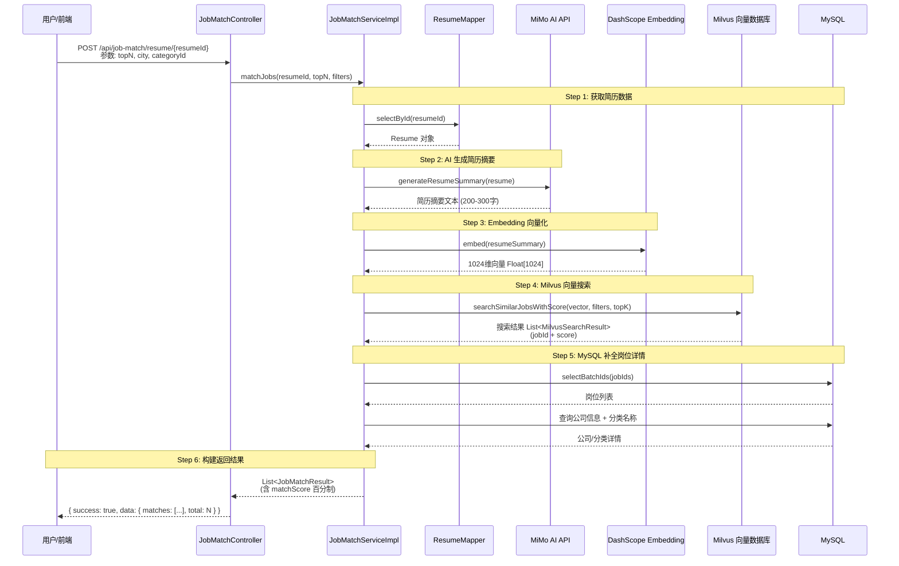
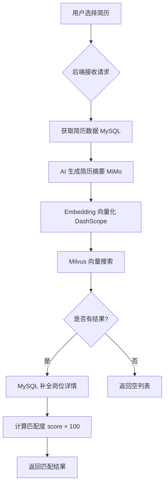

# 岗位智能匹配模块设计与实现

## 一、功能概述

基于简历内容，通过 AI 生成语义摘要，再利用向量数据库进行语义级岗位匹配，返回带匹配度评分的推荐结果。

**核心流程**：简历 → AI 摘要 → Embedding 向量化 → Milvus ANN 搜索 → MySQL 补全详情 → 返回匹配结果

---

## 二、技术架构

```
┌─────────────────────────────────────────────────────────────────┐
│                        前端 (Vue 3)                              │
│  ┌──────────────────────────────────────────────────────────┐   │
│  │  JobMatch.vue - 简历选择 + 筛选条件 + 匹配结果展示        │   │
│  └──────────────────────────────────────────────────────────┘   │
└────────────────────────────┬────────────────────────────────────┘
                             │ POST /api/job-match/resume/{resumeId}
                             ▼
┌─────────────────────────────────────────────────────────────────┐
│                      后端 (Spring Boot)                          │
│  ┌──────────────────────────────────────────────────────────┐   │
│  │  JobMatchController - 接口入口                           │   │
│  └──────────────────────────────────────────────────────────┘   │
│                             │                                    │
│  ┌──────────────────────────────────────────────────────────┐   │
│  │  JobMatchServiceImpl - 核心业务编排                       │   │
│  │    1. 获取简历                                            │   │
│  │    2. AI 生成摘要                                         │   │
│  │    3. Embedding 向量化                                    │   │
│  │    4. Milvus 向量搜索                                    │   │
│  │    5. MySQL 补全详情                                     │   │
│  └──────────────────────────────────────────────────────────┘   │
└────────────────────────────┬────────────────────────────────────┘
                             │
         ┌───────────────────┼───────────────────┐
         ▼                   ▼                   ▼
┌─────────────────┐ ┌─────────────────┐ ┌─────────────────┐
│  MiMo AI API    │ │  DashScope API  │ │  Milvus         │
│  生成简历摘要    │ │  Embedding 向量化│ │  向量相似度搜索  │
└─────────────────┘ └─────────────────┘ └─────────────────┘
```

---

## 三、时序图



---

## 四、核心源代码

### 4.1 接口定义 - MilvusService.java

```java
package com.interview.service;

import com.interview.domain.dto.MilvusSearchResult;
import java.util.List;
import java.util.Map;

public interface MilvusService {

    /**
     * 向量相似度搜索（返回分数）
     * @param queryVector 查询向量
     * @param filters 可选的标量过滤条件（如 city、categoryId）
     * @param topK 返回数量
     * @return 匹配结果列表（含 jobId 和相似度分数）
     */
    List<MilvusSearchResult> searchSimilarJobsWithScore(
        List<Float> queryVector, Map<String, String> filters, int topK);
}
```

### 4.2 搜索结果 DTO - MilvusSearchResult.java

```java
package com.interview.domain.dto;

import lombok.Data;

@Data
public class MilvusSearchResult {
    /** 岗位 ID */
    private Long jobId;
    /** 相似度分数（0-1） */
    private Float score;

    public MilvusSearchResult(Long jobId, Float score) {
        this.jobId = jobId;
        this.score = score;
    }
}
```

### 4.3 返回结果 VO - JobMatchResult.java

```java
package com.interview.vo;

import lombok.Data;

@Data
public class JobMatchResult {
    private Long jobId;           // 岗位 ID
    private String title;         // 岗位名称
    private String companyName;   // 公司名称
    private String companyLogo;   // 公司 Logo
    private String city;          // 城市
    private Integer salaryMin;    // 最低薪资
    private Integer salaryMax;    // 最高薪资
    private String experience;    // 经验要求
    private String education;     // 学历要求
    private String categoryName;  // 岗位分类名称
    private Integer matchScore;   // 匹配度（0-100）
    private String description;   // 岗位描述（截取前200字）
}
```

### 4.4 核心业务实现 - JobMatchServiceImpl.java

```java
package com.interview.service.impl;

import com.baomidou.mybatisplus.core.conditions.query.LambdaQueryWrapper;
import com.interview.domain.dto.MilvusSearchResult;
import com.interview.domain.po.Company;
import com.interview.domain.po.Job;
import com.interview.domain.po.Resume;
import com.interview.mapper.CompanyMapper;
import com.interview.mapper.JobCategoryMapper;
import com.interview.mapper.JobMapper;
import com.interview.mapper.ResumeMapper;
import com.interview.service.AIService;
import com.interview.service.EmbeddingService;
import com.interview.service.JobMatchService;
import com.interview.service.MilvusService;
import com.interview.vo.JobMatchResult;
import lombok.extern.slf4j.Slf4j;
import org.springframework.stereotype.Service;

import java.util.*;
import java.util.stream.Collectors;

/**
 * 岗位匹配服务实现
 * 核心流程：简历 → AI摘要 → Embedding → Milvus ANN搜索 → MySQL补全详情 → 返回匹配结果
 */
@Slf4j
@Service
public class JobMatchServiceImpl implements JobMatchService {

    private final ResumeMapper resumeMapper;
    private final JobMapper jobMapper;
    private final CompanyMapper companyMapper;
    private final JobCategoryMapper jobCategoryMapper;
    private final AIService aiService;
    private final EmbeddingService embeddingService;
    private final MilvusService milvusService;

    public JobMatchServiceImpl(ResumeMapper resumeMapper, JobMapper jobMapper,
                               CompanyMapper companyMapper, JobCategoryMapper jobCategoryMapper,
                               AIService aiService, EmbeddingService embeddingService,
                               MilvusService milvusService) {
        this.resumeMapper = resumeMapper;
        this.jobMapper = jobMapper;
        this.companyMapper = companyMapper;
        this.jobCategoryMapper = jobCategoryMapper;
        this.aiService = aiService;
        this.embeddingService = embeddingService;
        this.milvusService = milvusService;
    }

    @Override
    public List<JobMatchResult> matchJobs(Long resumeId, int topN, Map<String, String> filters) {
        log.info("开始岗位匹配: resumeId={}, topN={}", resumeId, topN);

        // 1. 获取简历
        Resume resume = resumeMapper.selectById(resumeId);
        if (resume == null) {
            throw new RuntimeException("简历不存在: " + resumeId);
        }

        // 2. AI 生成简历摘要（提取核心技能、经验、期望等）
        String resumeSummary = aiService.generateResumeSummary(resume);
        log.debug("简历摘要: {}",
            resumeSummary.substring(0, Math.min(100, resumeSummary.length())));

        // 3. Embedding 转向量（1024维）
        List<Float> queryVector = embeddingService.embed(resumeSummary);

        // 4. Milvus 向量搜索（带相似度分数）
        List<MilvusSearchResult> searchResults =
            milvusService.searchSimilarJobsWithScore(queryVector, filters, topN);

        if (searchResults.isEmpty()) {
            log.info("未找到匹配的岗位");
            return List.of();
        }

        // 5. MySQL 补全岗位详情（含匹配度分数）
        return buildMatchResults(searchResults);
    }

    /**
     * 根据搜索结果构建匹配结果
     * COSINE 相似度 0-1 → 百分制 0-100
     */
    private List<JobMatchResult> buildMatchResults(List<MilvusSearchResult> searchResults) {
        List<Long> jobIds = searchResults.stream()
                .map(MilvusSearchResult::getJobId)
                .collect(Collectors.toList());

        // 批量查询岗位
        List<Job> jobs = jobMapper.selectBatchIds(jobIds);
        if (jobs.isEmpty()) return List.of();

        Map<Long, Job> jobMap = jobs.stream()
                .collect(Collectors.toMap(Job::getId, j -> j));

        // 建立 jobId -> score 映射
        Map<Long, Float> scoreMap = new HashMap<>();
        for (MilvusSearchResult sr : searchResults) {
            scoreMap.put(sr.getJobId(), sr.getScore());
        }

        // 批量查询公司
        Set<Long> companyIds = jobs.stream()
                .map(Job::getCompanyId)
                .filter(Objects::nonNull)
                .collect(Collectors.toSet());
        Map<Long, Company> companyMap = new HashMap<>();
        if (!companyIds.isEmpty()) {
            companyMapper.selectBatchIds(companyIds)
                .forEach(c -> companyMap.put(c.getId(), c));
        }

        // 批量查询分类名
        Set<Long> categoryIds = jobs.stream()
                .map(Job::getCategoryId)
                .filter(Objects::nonNull)
                .collect(Collectors.toSet());
        Map<Long, String> categoryMap = new HashMap<>();
        for (Long catId : categoryIds) {
            var cat = jobCategoryMapper.selectById(catId);
            if (cat != null) categoryMap.put(catId, cat.getName());
        }

        // 构建结果（保持 Milvus 返回的排序）
        List<JobMatchResult> results = new ArrayList<>();
        for (MilvusSearchResult sr : searchResults) {
            Job job = jobMap.get(sr.getJobId());
            if (job == null) continue;

            JobMatchResult result = new JobMatchResult();
            result.setJobId(job.getId());
            result.setTitle(job.getTitle());
            result.setCity(job.getCity());
            result.setSalaryMin(job.getSalaryMin());
            result.setSalaryMax(job.getSalaryMax());
            result.setExperience(job.getExperience());
            result.setEducation(job.getEducation());
            result.setDescription(job.getDescription() != null
                    ? job.getDescription().substring(0,
                        Math.min(200, job.getDescription().length()))
                    : "");

            // 设置匹配度（COSINE 相似度 0-1 → 百分制 0-100）
            Float score = scoreMap.get(sr.getJobId());
            if (score != null) {
                result.setMatchScore(Math.round(score * 100));
            }

            Company company = companyMap.get(job.getCompanyId());
            if (company != null) {
                result.setCompanyName(company.getName());
                result.setCompanyLogo(company.getLogo());
            }

            result.setCategoryName(categoryMap.get(job.getCategoryId()));
            results.add(result);
        }

        return results;
    }

    // ... 其他方法（syncJobToMilvus、syncAllJobsToMilvus 等）
}
```

### 4.5 Milvus 向量搜索实现 - MilvusServiceImpl.java

```java
@Override
public List<MilvusSearchResult> searchSimilarJobsWithScore(
        List<Float> queryVector, Map<String, String> filters, int topK) {
    checkClient();
    String collectionName = milvusConfig.getCollection();

    // 构建过滤表达式
    List<String> conditions = new ArrayList<>();
    conditions.add("status == \"active\"");

    if (filters != null) {
        if (filters.containsKey("city") && !filters.get("city").isEmpty()) {
            conditions.add("city == \"" + filters.get("city") + "\"");
        }
        if (filters.containsKey("categoryId") && !filters.get("categoryId").isEmpty()) {
            conditions.add("category_id == " + filters.get("categoryId"));
        }
    }

    String filterExpr = String.join(" && ", conditions);

    // 执行向量搜索（COSINE 相似度）
    SearchResp searchResp = client.search(SearchReq.builder()
            .collectionName(collectionName)
            .data(List.of(new FloatVec(queryVector)))
            .annsField("vector")
            .metricType(IndexParam.MetricType.COSINE)
            .topK(topK)
            .filter(filterExpr)
            .outputFields(List.of("job_id"))
            .build());

    // 提取结果中的 job_id 和 score
    List<MilvusSearchResult> results = new ArrayList<>();
    if (searchResp.getSearchResults() != null) {
        for (List<SearchResp.SearchResult> searchResults : searchResp.getSearchResults()) {
            for (SearchResp.SearchResult result : searchResults) {
                Object jobIdObj = result.getEntity().get("job_id");
                if (jobIdObj != null) {
                    Long jobId = ((Number) jobIdObj).longValue();
                    Float score = result.getScore();  // COSINE 相似度 0-1
                    results.add(new MilvusSearchResult(jobId, score));
                }
            }
        }
    }

    log.debug("向量搜索完成: 返回 {} 条结果", results.size());
    return results;
}
```

### 4.6 控制器 - JobMatchController.java

```java
package com.interview.controller;

import com.interview.common.Result;
import com.interview.service.JobMatchService;
import com.interview.vo.JobMatchResult;
import lombok.extern.slf4j.Slf4j;
import org.springframework.web.bind.annotation.*;

import java.util.*;

@Slf4j
@RestController
@RequestMapping("/api/job-match")
public class JobMatchController {

    private final JobMatchService jobMatchService;

    public JobMatchController(JobMatchService jobMatchService) {
        this.jobMatchService = jobMatchService;
    }

    /**
     * 根据简历匹配岗位
     * POST /api/job-match/resume/{resumeId}
     *
     * @param resumeId 简历 ID
     * @param topN 返回数量（默认10）
     * @param city 城市过滤（可选）
     * @param categoryId 分类过滤（可选）
     */
    @PostMapping("/resume/{resumeId}")
    public Result<Map<String, Object>> matchJobs(
            @PathVariable Long resumeId,
            @RequestParam(defaultValue = "10") int topN,
            @RequestParam(required = false) String city,
            @RequestParam(required = false) String categoryId) {

        log.info("岗位匹配请求: resumeId={}, topN={}, city={}, categoryId={}",
                resumeId, topN, city, categoryId);

        // 构建过滤条件
        Map<String, String> filters = new HashMap<>();
        if (city != null && !city.isEmpty()) {
            filters.put("city", city);
        }
        if (categoryId != null && !categoryId.isEmpty()) {
            filters.put("categoryId", categoryId);
        }

        List<JobMatchResult> matches = jobMatchService.matchJobs(resumeId, topN, filters);

        Map<String, Object> data = new HashMap<>();
        data.put("matches", matches);
        data.put("total", matches.size());

        return Result.ok(data);
    }
}
```

### 4.7 前端页面 - JobMatch.vue

```vue
<template>
  <AppShell :bgImage="false">
    <div class="match-page">
      <div class="match-page__container">
        <!-- 左侧面板：简历选择 + 筛选条件 -->
        <aside class="sidebar">
          <div class="sidebar-card">
            <h3 class="sidebar-card__title">选择简历</h3>
            <div class="resume-select-list">
              <div v-for="resume in resumeList" :key="resume.id"
                   class="resume-select-item"
                   :class="{ active: selectedResumeId === resume.id }"
                   @click="selectResume(resume)">
                <div class="resume-select-item__icon"> </div>
                <div class="resume-select-item__info">
                  <div class="resume-select-item__name">{{ resume.fileName }}</div>
                </div>
              </div>
            </div>
          </div>

          <div class="sidebar-card" v-if="selectedResumeId">
            <h3 class="sidebar-card__title">筛选条件</h3>
            <el-form label-position="top">
              <el-form-item label="城市">
                <el-input v-model="filters.city" placeholder="如：北京" clearable />
              </el-form-item>
              <el-form-item label="返回数量">
                <el-input-number v-model="filters.topN" :min="5" :max="30" />
              </el-form-item>
              <el-button type="primary" @click="handleMatch"
                         :loading="loading" style="width:100%">
                开始匹配
              </el-button>
            </el-form>
          </div>
        </aside>

        <!-- 右侧结果区 -->
        <main class="content">
          <div class="content-panel">
            <div class="content-header">
              <h2>匹配结果</h2>
              <span v-if="matchResults.length > 0">
                共找到 <strong>{{ matchResults.length }}</strong> 个匹配岗位
              </span>
            </div>

            <div v-if="!loading && matchResults.length > 0" class="match-list">
              <div v-for="item in matchResults" :key="item.jobId"
                   class="match-card" @click="$router.push(`/job/${item.jobId}`)">
                <!-- 匹配度标签 -->
                <div class="match-card__score" :class="getScoreClass(item.matchScore)">
                  <span class="match-card__score-num">{{ item.matchScore }}</span>
                  <span class="match-card__score-label">匹配度</span>
                </div>

                <!-- 岗位信息 -->
                <div class="match-card__main">
                  <h4 class="match-card__title">{{ item.title }}</h4>
                  <div class="match-card__company">{{ item.companyName }}</div>
                  <div class="match-card__meta">
                    <span v-if="item.city">{{ item.city }}</span>
                    <span v-if="item.salaryMin">{{ formatSalary(item.salaryMin, item.salaryMax) }}</span>
                  </div>
                </div>
              </div>
            </div>
          </div>
        </main>
      </div>
    </div>
  </AppShell>
</template>

<script setup>
import { ref, onMounted } from 'vue'
import { matchJobsByResume } from '@/api/jobMatch'

const selectedResumeId = ref(null)
const matchResults = ref([])
const loading = ref(false)
const filters = ref({ city: '', topN: 10 })

const handleMatch = async () => {
  loading.value = true
  try {
    const res = await matchJobsByResume(selectedResumeId.value, filters.value)
    matchResults.value = res?.data?.matches || []
  } finally {
    loading.value = false
  }
}

const getScoreClass = (score) => {
  if (score >= 80) return 'score--high'
  if (score >= 60) return 'score--medium'
  return 'score--low'
}
</script>
```

---

## 五、数据流向图



---

## 六、关键设计决策

| 决策点 | 方案 | 原因 |
|--------|------|------|
| 向量维度 | 1024 维 | DashScope text-embedding-v3 默认维度，平衡精度与性能 |
| 相似度算法 | COSINE | 适合文本语义匹配，不受向量长度影响 |
| 索引类型 | IVF_FLAT | 128 个聚类中心，平衡搜索速度与精度 |
| 匹配度计算 | score × 100 取整 | COSINE 返回 0-1，转换为百分制更直观 |
| 过滤时机 | Milvus 端过滤 | 减少返回数据量，提升搜索效率 |
| 批量查询 | MySQL 批量 | 减少数据库查询次数，提升响应速度 |

---

## 七、API 接口文档

### 岗位匹配

**请求**

```
POST /api/job-match/resume/{resumeId}
```

**参数**

| 参数 | 类型 | 必填 | 说明 |
|------|------|------|------|
| resumeId | Long | 是 | 简历 ID |
| topN | int | 否 | 返回数量，默认 10 |
| city | String | 否 | 城市过滤 |
| categoryId | String | 否 | 岗位分类过滤 |

**响应**

```json
{
  "success": true,
  "data": {
    "total": 10,
    "matches": [
      {
        "jobId": 123,
        "title": "Java后端开发",
        "companyName": "腾讯",
        "companyLogo": "https://...",
        "city": "深圳",
        "salaryMin": 20000,
        "salaryMax": 35000,
        "experience": "3-5年",
        "education": "本科",
        "categoryName": "后端开发",
        "matchScore": 87,
        "description": "负责核心系统开发..."
      }
    ]
  }
}
```
